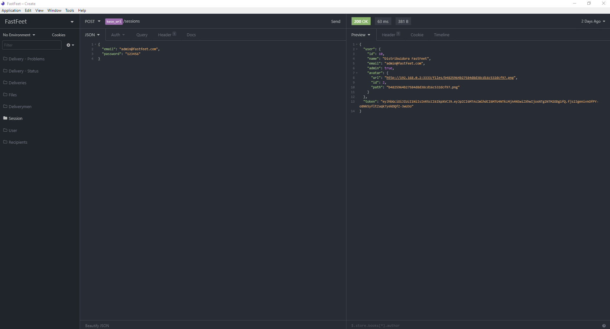

<h1 align="center">
  
</h1>

<p align="center">
  

  
  
  <a href="https://github.com/raphabarreto/fastfeet/commits/master">
    
  </a>

  <a href="https://github.com/raphabarreto/fastfeet/issues">
    
  </a>

  
</p>


<p align="center">Nesse projeto foi desenvolvido uma aplicação Back-end, Front-end e Mobile para uma transportadora fictícia, o FastFeet </a>.</p>


# 🚀 Tecnologias

- ⚡ [JavaScript](https://skylab.rocketseat.com.br/journey/starter)

- ⚡ [Node](https://nodejs.org/en/)
- ⚡ [Sequelize](https://sequelize.org/)
- ⚡ [React](https://pt-br.reactjs.org/)
- ⚡ [React Native](https://reactnative.dev/)
- ⚡ [Redux](https://redux.js.org/)
- ⚡ [Redux Saga](https://redux-saga.js.org/)
- ⚡ [Arquitetura Flux](https://facebook.github.io/flux/)
- ⚡ [React Hooks](https://pt-br.reactjs.org/docs/hooks-intro.html)


# 🔥 Instalação e execução
1. Faça o clone do projeto `git clone git@github.com:raphabarreto/fastfeet.git`

# 💻 Backend
1. Entre na pasta `backend`;

2. Execute `yarn install` para instalar todas as dependências;
3. Crie os seguintes contâiners no docker:
 ```
 docker run --name database -e POSTGRES_PASSWORD=[DB_PASS] -p 5432:5432 -d [DB_USER]
 ```
 ```
 docker run --name redisfastfeet -p 6379:6379 -d -t redis:alpine
 ```
* `Lembrando que é necessário renomear o arquivo .env.example para .env e assim colocar as suas devidas variáveis de acordo com seu ambiente;`
4. Execute as migrations com `yarn sequelize db:migrate`;

5. Execute as seeds com `yarn sequelize db:seed:all`;
6. Clique neste botão [](https://insomnia.rest/run/?label=Fastfeet&uri=https%3A%2F%2Fraw.githubusercontent.com%2Fraphabarreto%2Ffastfeet%2Fmaster%2Fbackend%2FFastFeet.json) para que seja importado todo o workspace no seu Insomnia ou navegue até **[aqui](https://github.com/raphabarreto/fastfeet/blob/master/backend/FastFeet.json)** para acessar o arquivo JSON para consumo da API.
7. E por último execute os comandos `yarn dev` e logo após `yarn queue`;

# 💻 Frontend
1. Entre na pasta `frontend`;

2. Execute `yarn install` para instalar todas as dependências;
3. Execute `yarn start` para inicializar a aplicação

# 💻 Mobile
### ``Somente android``
1. Entre na pasta `mobile`;

2. Execute `yarn install` para instalar todas as dependências;
3. Renomeie o arquivo `.env-example` para `.env` e coloque `http://localhost:3333`, caso queira testar no emulador ou o `ip da sua máquina:3333` , caso queira testar no seu smartphone;
4. Não se esqueça do `backend` estar rodando.
5. Execute `yarn react-native run-android` para que o projeto seja inicializado;

# 🔨 Resultado - Backend
<h1 align="center">

<a href="https://insomnia.rest/run/?label=Fastfeet&uri=https%3A%2F%2Fraw.githubusercontent.com%2Fraphabarreto%2Ffastfeet%2Fmaster%2Fbackend%2FFastFeet.json" target="_blank"></a>
</h1>

# 🌐 Resultado - Front-end
<h1 align="center">
    
</h1>

# 📱 Resultado - Mobile
<h1 align="center">
    
</h1>

## 🧾 Licença

Esse projeto está sob a licença MIT. Veja o arquivo [LICENSE](LICENSE.md) para mais detalhes.

---

Feito com 💖 por [Raphael Barreto](https://www.linkedin.com/in/raphael-barreto-15631747/)
graças a [Rocketseat](https://rocketseat.com.br/)🚀
